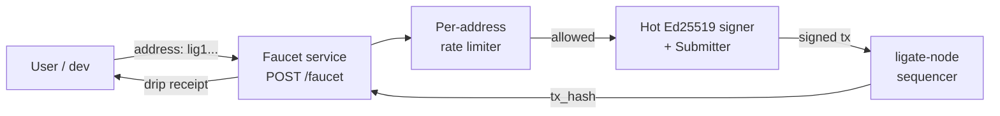

# ligate-faucet

[](https://github.com/ligate-io/faucet/actions/workflows/ci.yml) [](#license) [](https://github.com/ligate-io/ligate-chain) [](https://docs.ligate.io) [](#status)

Devnet faucet for [Ligate Chain](https://github.com/ligate-io/ligate-chain). Rate-limited HTTP service that drips `$LGT` to fresh addresses so anyone can transact.

## Quick start

### Hit the public faucet

```bash
curl -X POST https://faucet.ligate.io/faucet \
    -H 'Content-Type: application/json' \
    -d '{"address":"lig1xyz..."}'
```

Or with the Ligate CLI:

```bash
ligate faucet lig1xyz...
```

### Run your own

```bash
git clone https://github.com/ligate-io/faucet
cd faucet

# Required first install (Ubuntu/Debian)
sudo apt install -y libclang-dev clang
# macOS:  xcode-select --install

# Configure
cp .env.example .env
$EDITOR .env       # fill in FAUCET_SIGNER_KEY, chain identity vars

# Run
cargo run --release
```

The HTTP server binds to `0.0.0.0:8080` by default. See [`.env.example`](.env.example) for every variable.

## What this is

A standalone HTTP service that holds a hot Ed25519 signer key (pre-funded at chain genesis) and signs `bank.transfer` calls on demand. Each request drips a fixed `$LGT` amount to one recipient address, bounded by a per-address cooldown. Closes the chicken-and-egg problem of a public devnet: anyone can submit a transaction, but no one has `$LGT` to pay the fees until they hit the faucet.

Who this exists for:

- **Themisra evaluators** registering schemas + submitting attestations end-to-end.
- **Iris MCP testers** running the relayer against the public chain.
- **Mneme wallet QA** running integration tests.
- **Auditors and reviewers** running published examples.

The faucet runs as its own process (NOT part of `ligate-node`):

- Holds a hot Ed25519 signer key, address pre-funded at chain genesis.
- Is **separate** from the bootstrap / treasury key so faucet drains don't touch treasury.
- Rate-limits per recipient address (24h cooldown by default).

## Status

**Devnet.** `ligate-devnet-1` is live. Tracking issue: [`ligate-chain#95`](https://github.com/ligate-io/ligate-chain/issues/95).

The chain submission pipeline is wired to real transactions: builds `bank.transfer`, signs against the chain's `CHAIN_HASH`, submits via `ligate_client::submit::Submitter`. See [`CHANGELOG.md`](CHANGELOG.md).

## HTTP API

### `POST /faucet`

```bash
curl -X POST https://faucet.ligate.io/faucet \
    -H 'Content-Type: application/json' \
    -d '{"address":"lig1xyz..."}'
```

**Success (200)**:

```json
{
  "address": "lig1xyz...",
  "tx_hash": "0x...",
  "amount_nano": 1000000000,
  "drip_amount_lgt": 1.0
}
```

**Rate-limited (429)**:

```json
{
  "error": "address rate-limited; retry in 86341 seconds",
  "retry_after_secs": 86341
}
```

**Bad address (400)**:

```json
{ "error": "expected lig1... bech32m, got celestia1...", "retry_after_secs": null }
```

### `GET /faucet/status`

Liveness + current-policy snapshot.

```json
{
  "drip_amount_nano": 1000000000,
  "drip_amount_lgt": 1.0,
  "rate_limit_secs": 86400,
  "addresses_dripped": 42
}
```

### `GET /health`

Always 200. Wire to k8s `livenessProbe` / load-balancer health checks.

## Configuration

All env vars (full reference in [`.env.example`](.env.example)):

| Var | Required | Default | Notes |
|---|---|---|---|
| `FAUCET_BIND` | no | `0.0.0.0:8080` | HTTP bind address |
| `FAUCET_CHAIN_RPC` | **yes** | — | e.g. `https://rpc.ligate.io` |
| `FAUCET_SIGNER_KEY` | **yes** | — | 64-char hex Ed25519 private key |
| `FAUCET_CHAIN_ID` | **yes** | — | numeric, from `chain_state.json` |
| `FAUCET_CHAIN_HASH` | **yes** | — | 64-char hex, from `/v1/rollup/info` |
| `FAUCET_LGT_TOKEN_ID` | **yes** | — | hex, from `bank.json`'s `token_id` |
| `FAUCET_DRIP_AMOUNT` | no | `1000000000` | nano-LGT per drip (1 LGT) |
| `FAUCET_RATE_LIMIT_SECS` | no | `86400` | cooldown per recipient address |
| `FAUCET_STARTING_NONCE` | no | `0` | bump on redeploy if previous instance burned nonces |
| `RUST_LOG` | no | `info,ligate_faucet=info` | tracing filter |

Generate a signer key with the chain repo's `ligate-genesis-tool`:

```bash
cd ligate-chain
cargo run -p ligate-genesis-tool -- keys generate \
    --roles faucet \
    --output ~/.ligate-keys/devnet-1
```

The `lig1...` address from `~/.ligate-keys/devnet-1/faucet.address` must be pre-funded at chain genesis (substitute it into `devnet-1/keys.toml` under `bank.json`'s `address_and_balances`).

The 64-char hex from `~/.ligate-keys/devnet-1/faucet.key` is the value for `FAUCET_SIGNER_KEY`.

> **Never commit a real `FAUCET_SIGNER_KEY`.** Inject via secret manager (1Password CLI, GCP Secret Manager, AWS Secrets Manager).

## Architecture



The signer holds an in-memory atomic nonce counter so concurrent requests get distinct nonces. The rate limiter is in-memory per-address (`DashMap<Address, Instant>`); restart resets the window. Both choices trade durability for simplicity at v0.

## Deploying

### docker-compose

```yaml
services:
  faucet:
    image: ghcr.io/ligate-io/faucet:latest
    restart: unless-stopped
    environment:
      FAUCET_CHAIN_RPC: https://rpc.ligate.io
      FAUCET_SIGNER_KEY: ${FAUCET_SIGNER_KEY}
      FAUCET_CHAIN_ID: ${FAUCET_CHAIN_ID}
      FAUCET_CHAIN_HASH: ${FAUCET_CHAIN_HASH}
      FAUCET_LGT_TOKEN_ID: ${FAUCET_LGT_TOKEN_ID}
      FAUCET_DRIP_AMOUNT: 1000000000
    ports:
      - "127.0.0.1:8080:8080"
```

Front with Caddy or Cloudflare Tunnel for public TLS at `faucet.ligate.io`.

### From source

```bash
cargo run --release
```

Reads env from the shell. Recommended only for local dev; production should use the Docker image.

## Rate-limit design

In-memory per-address (`Mutex<HashMap>`). Trades durability for simplicity:

- Faucet restart resets the window. Operators don't restart mid-day under normal conditions; if you do, anyone who already dripped can drip again immediately. Fine for v0.
- No per-IP limit. Adversaries can rotate IPs trivially (any cloud, any VPN); per-IP is theatre, per-address is the substantive defense.

For sustained-attack scenarios (sub-Sybil-resistant minting), escalate via:

1. Persisting rate-limit state to disk / Redis.
2. Adding a small captcha or proof-of-work on the request.
3. Reducing drip amount or extending the window.

None of these are v0 work.

## Development

```bash
cargo build       # compile
cargo run         # local server (requires .env)
cargo fmt
cargo clippy --all-targets -- -D warnings
```

The `cargo test` job is intentionally disabled in CI (the chain's risc0 prover crate, transitively pulled via `ligate-rollup`, trips its build script under `cargo test` even with `SKIP_GUEST_BUILD=1`). Real integration tests live in the chain workspace.

## Related

- Tracking: [`ligate-chain#95`](https://github.com/ligate-io/ligate-chain/issues/95) (faucet itself), [`#240`](https://github.com/ligate-io/ligate-chain/issues/240) (SDK pipeline this consumes)
- Chain SDK: [`ligate-io/ligate-chain/crates/client-rs`](https://github.com/ligate-io/ligate-chain/tree/main/crates/client-rs)
- CLI consumer: [`ligate-io/ligate-cli`](https://github.com/ligate-io/ligate-cli) (`ligate faucet ...`)
- Operator runbook: [`devnet-1 deploy guide`](https://github.com/ligate-io/ligate-chain/blob/main/docs/development/public-devnet-deploy.md)

## License

Apache-2.0 OR MIT, at your option. See [`LICENSE-APACHE`](LICENSE-APACHE) and [`LICENSE-MIT`](LICENSE-MIT).
